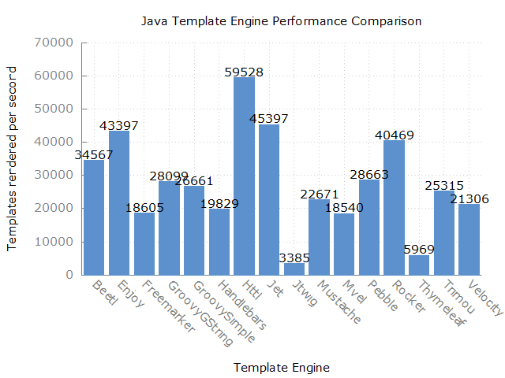

template-benchmark
================

JMH benchmark for popular Java template engines:

* [Freemarker](http://freemarker.org/)
* [Mustache](https://github.com/spullara/mustache.java)
* [Pebble](http://www.mitchellbosecke.com/pebble)
* [Rocker](https://github.com/fizzed/rocker)
* [Thymeleaf](http://www.thymeleaf.org/)
* [Trimou](http://trimou.org/)
* [Velocity](http://velocity.apache.org/)
* [HTTL](http://httl.github.io/zh/)
* [enjoy](https://www.jfinal.com/doc/6-4)
* [Beetl](http://ibeetl.com/)
* [Jtwig](http://jtwig.org/)
* [mvel](http://mvel.documentnode.com/#mvel-2.0-templating-guide)

Running the benchmark
======================

1. Download the source code and build it (`mvn clean package`)
2. Run the entire benchmark suite with `java -jar target/benchmarks.jar`
3. (Optional) To run a single benchmark, such as Mustache, use `java -jar target/benchmarks.jar Mustache`
4. (Optional) for fast test, use: 
`java -jar target/benchmarks.jar  Httl GroovyGStringTemplate Rocker  -w 1 -r 1  -wi 5 -i 10 -f 1`
`java -jar target/benchmarks.jar -w 1 -r 1  -wi 5 -i 10 -f 1 -tu ms`

Generating plot
===============
1. Run benchmark while exporting results to csv with `java -jar target/benchmarks.jar -rff results.csv -rf csv`

2. Use gnuplot to generate plot with `gnuplot benchmark.plot`. This will output `results.png`.

Rules of Template Engine Configuration
======================================
It is imperative that each template engine is configured in way to reflect real-world usage as opposed to it's *optimal* configuration. Typically this means an out-of-the-box configuration.

To strive for a common set of features across template engines, the following configurations are expected:
* Disabling of HTML escaping
* Template loaded from classpath prior to actual benchmark

Interpreting the Results
========================
The benchmarks measure throughput, given in "ops/time". The time unit used is seconds.
Generally, the score represents the number of templates rendered per second; the higher the score, the better.

Example Results
===============

```
Benchmark                 Mode  Cnt      Score      Error  Units  Score/min
Beetl.benchmark          thrpt   10  34567.034 ±  256.611  ops/s     10.211
Enjoy.benchmark          thrpt   10  43397.859 ±  311.698  ops/s     12.819
Freemarker.benchmark     thrpt   10  18605.096 ±  253.902  ops/s      5.496
GroovyGString.benchmark  thrpt   10  28099.659 ±  138.452  ops/s      8.300
GroovySimple.benchmark   thrpt   10  26661.763 ±  192.918  ops/s      7.876
Handlebars.benchmark     thrpt   10  19829.242 ±  176.739  ops/s      5.857
Httl.benchmark           thrpt   10  59528.885 ± 3592.575  ops/s     17.584
Jet.benchmark            thrpt   10  45397.569 ±  668.153  ops/s     13.410
Jtwig.benchmark          thrpt   10   3385.342 ±   31.189  ops/s      1.000
Mustache.benchmark       thrpt   10  22671.380 ±  465.540  ops/s      6.697
Mvel.benchmark           thrpt   10  18540.058 ±  179.713  ops/s      5.477
Pebble.benchmark         thrpt   10  28663.258 ±  305.974  ops/s      8.467
Rocker.benchmark         thrpt   10  40469.989 ±  199.977  ops/s     11.954
Thymeleaf.benchmark      thrpt   10   5969.075 ±   26.323  ops/s      1.763
Trimou.benchmark         thrpt   10  25315.292 ±  183.020  ops/s      7.478
Velocity.benchmark       thrpt   10  21306.506 ±  237.285  ops/s      6.294
```

